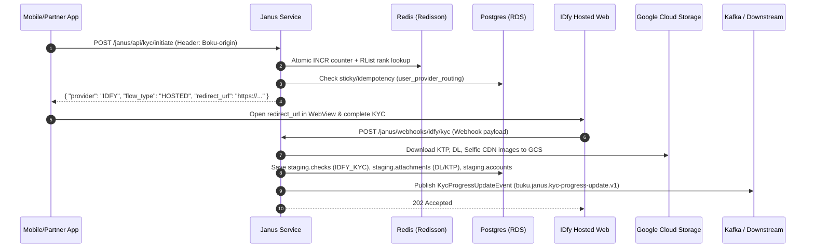

# Janus IDfy Integration & Dynamic Routing — Knowledge Transfer (KT) Document

| Metadata | Details |
| :--- | :--- |
| **Document Title** | End-to-End Technical Knowledge Transfer: IDfy Integration & Dynamic Provider Routing |
| **Target Service** | Janus Microservice (`buku-services/janus`) |
| **Target Modules** | `app`, `core`, `persistence`, `provider` |
| **Author** | Senior Engineering Team |
| **Last Updated** | July 2026 |

---

## 1. Executive Summary & Architecture Overview

Janus integrates **IDfy** as a second identity verification (KYC/KYB) provider alongside the existing **VIDA** provider. Unlike legacy API-driven providers (VIDA / ILUMA) where Janus orchestrates individual API calls mid-flow, IDfy operates on a **hosted/redirect journey model**:

1. Janus issues an initiation request to IDfy to generate a secure journey profile URL.
2. The mobile app opens the IDfy hosted WebView journey (`HOSTED` flow).
3. The user completes KTP/Driver's License OCR, liveness, and face matching directly on IDfy's UI.
4. IDfy sends an asynchronous webhook (`POST /janus/webhooks/idfy/kyc`) back to Janus.
5. Janus downloads image assets, persists domain checks/attachments, updates account metadata/tier, and emits Kafka progress events to downstream microservices.



---

## 2. Dynamic Provider Routing Architecture

### 2.1 Component & Module Layout

The dynamic routing subsystem is decoupled into explicit modules:

```
┌────────────────────────────────────────────────────────────────────────────────────────┐
│ app module                                                                             │
│  ├── KycInitiateController   ➜ POST /janus/api/kyc/initiate                            │
│  └── OpsRoutingController    ➜ GET/POST /janus/ops/routing/config & /refresh          │
├────────────────────────────────────────────────────────────────────────────────────────┤
│ core module                                                                            │
│  ├── KycRoutingService       ➜ Implements 5-step routing algorithm & DB fallback       │
│  ├── RoutingRefreshService   ➜ Rebuilds 100-slot rank array in Redis                   │
│  ├── LoadDistributorPort     ➜ Output port for Redis operations                         │
│  └── LoadDistributorDbPort   ➜ Output port for DB config & routing persistence          │
├────────────────────────────────────────────────────────────────────────────────────────┤
│ persistence module                                                                     │
│  ├── LoadDistributorRedisAdapter ➜ Redisson atomic batch INCR & 100-slot RList          │
│  └── LoadDistributorDbAdapter    ➜ PostgreSQL Spring Data Repositories                 │
└────────────────────────────────────────────────────────────────────────────────────────┘
```

### 2.2 Routing Data Model & Schema

#### A. `load_distribution_config` Table
Defines percentage allocations, priority rank, and feature state per `app_origin`:
```sql
CREATE TABLE load_distribution_config (
    id UUID PRIMARY KEY DEFAULT gen_random_uuid(),
    app_origin VARCHAR(64) NOT NULL,
    provider VARCHAR(32) NOT NULL,    -- 'VIDA', 'IDFY'
    allocation INT NOT NULL CHECK (allocation >= 0 AND allocation <= 100),
    rank INT NOT NULL,
    active BOOLEAN NOT NULL DEFAULT TRUE,
    CONSTRAINT uq_app_provider UNIQUE (app_origin, provider)
);
```

#### B. `load_distributor` Table (Shuffled Rank Slot Array)
Stores a 100-element JSONB array of rank integers generated via **Fisher-Yates shuffle**:
```sql
CREATE TABLE load_distributor (
    id UUID PRIMARY KEY DEFAULT gen_random_uuid(),
    app_origin VARCHAR(64) NOT NULL UNIQUE,
    load_distributor JSONB NOT NULL -- e.g. [1, 2, 1, 1, 2, 1, 2, ...]
);
```

#### C. `user_provider_routing` Table (User Journey State)
Tracks per-user routing decisions, journey status, and debugging metadata:
```sql
CREATE TABLE user_provider_routing (
    id UUID PRIMARY KEY DEFAULT gen_random_uuid(),
    account_id VARCHAR(64) NOT NULL,
    provider_used VARCHAR(32) NOT NULL,
    status VARCHAR(32) NOT NULL, -- 'IN_PROGRESS', 'VERIFIED', 'REJECTED', 'PENDING_MANUAL_VERIFICATION'
    app_used VARCHAR(64),
    metadata JSONB               -- e.g. {"resolved_rank": 1, "redis_slot_index": 42}
);
```

### 2.3 The 5-Step Routing Algorithm ([KycRoutingService.java](file:///Users/pradeepkumar/Desktop/buku-services/janus/core/src/main/java/com/bukuwarung/janus/application/service/routing/KycRoutingService.java))

```
Step 1: IDEMPOTENCY CHECK (Mid-Journey User)
  SELECT * FROM user_provider_routing WHERE account_id = ? AND status = 'IN_PROGRESS'
  IF found ➜ Return existing provider (user is mid-journey; no re-routing allowed)

Step 2: STICKY ROUTING CHECK (Re-KYC User)
  SELECT * FROM user_provider_routing WHERE account_id = ? AND status = 'VERIFIED'
  IF found ➜ Return same provider_used (re-KYC stays on same provider for data consistency)

Step 3: ATOMIC REDIS COUNTER & RANK LOOKUP (New User)
  counter   = RAtomicLong("routing:counter:{app_origin}").incrementAndGet()
  slotIndex = (counter - 1) % 100
  rank      = RList<Integer>("routing:distributor:{app_origin}").get(slotIndex)
  provider  = SELECT provider FROM load_distribution_config WHERE app_origin=? AND rank=?

Step 4: REDIS FALLBACK NET
  IF Redis unavailable ➜ bucket = abs(accountId.hashCode()) % 100 applied to DB config rows

Step 5: RECORD IN DB & RETURN
  INSERT INTO user_provider_routing (account_id, provider_used, status = 'IN_PROGRESS', ...)
  RETURN selected provider to caller
```

> [!NOTE]
> **Rank-Based Indirection:** Redis arrays store rank integers (`1`, `2`) rather than provider name strings (`"VIDA"`, `"IDFY"`). Swapping which provider handles Rank 1 requires only a database update—Redis arrays do **not** need to be cleared or rebuilt.

---

## 3. IDfy Journey Initiation & App Flow

### 3.1 Endpoint Contract: `POST /janus/api/kyc/initiate`
* **Controller**: [KycInitiateController.java](file:///Users/pradeepkumar/Desktop/buku-services/janus/app/src/main/java/com/bukuwarung/janus/app/api/KycInitiateController.java)
* **Header**: `Boku-origin` (e.g., `bukuwarung-app`, `bukupay-retail`, `bukuwarung-edc`)

#### Response Payload (IDfy Selected):
```json
{
  "provider": "IDFY",
  "flow_type": "HOSTED",
  "redirect_url": "https://360.grus.idfy.com/noauth/56a45e6d-698a-4c67-ab9f-28bbf76cdbba",
  "journey_id": "bea5cb72-04ad-46ec-b7d9-4d1b3c6bfb42",
  "expiry": "2028-01-16T21:39:57.257Z"
}
```

### 3.2 Key Service Reference: [InitiateIdyfyJourneyService.java](file:///Users/pradeepkumar/Desktop/buku-services/janus/core/src/main/java/com/bukuwarung/janus/application/service/idfy/InitiateIdyfyJourneyService.java)
- Calls IDfy API to register profile and create a journey session.
- Persists initial `IdyfyKycCheck` row in `staging.checks` with `check_type = 'IDFY_KYC'` and status `IN_PROGRESS`.

---

## 4. Inbound Webhook Processing Pipeline

### 4.1 Ingress Controller: `POST /janus/webhooks/idfy/kyc`
* **Controller**: [IdfyCallbackController.java](file:///Users/pradeepkumar/Desktop/buku-services/janus/app/src/main/java/com/bukuwarung/janus/app/api/webhooks/IdfyCallbackController.java)
* **Feature Flag**: `idfy.callback.enabled` (returns `503` if disabled).

### 4.2 Webhook Execution Service: [ProcessIdfyKycWebhookService.java](file:///Users/pradeepkumar/Desktop/buku-services/janus/core/src/main/java/com/bukuwarung/janus/application/service/idfy/ProcessIdfyKycWebhookService.java)

1. **Check Retrieval & Deduplication**:
   - Queries `staging.checks` by `journeyId` (`profileId`).
   - Skips processing if the check is already in a terminal state (`VERIFIED`, `REJECTED`, `MANUALLY_VERIFIED`).
2. **Image Downloads ([IdyfyImageDownloadService.java](file:///Users/pradeepkumar/Desktop/buku-services/janus/core/src/main/java/com/bukuwarung/janus/application/service/idfy/IdyfyImageDownloadService.java))**:
   - Downloads CDN URLs from IDfy task payload **before opening the DB transaction**:
     - **KTP Front**: `tasks.ktp.sides.front.url` $\rightarrow$ stored under GCS `attachments/ktp/` $\rightarrow$ `AttachmentType.KTP`.
     - **Driver's License (DL)**: `tasks.dl.sides.front.url` $\rightarrow$ stored under GCS `attachments/additional/driving-license/` $\rightarrow$ `AttachmentType.DL`.
     - **Selfie**: `tasks.selfie.url` $\rightarrow$ stored under GCS `attachments/selfie/` $\rightarrow$ `AttachmentType.SELFIE`.
3. **Decision Mapping ([IdfyDecisionMapper.java](file:///Users/pradeepkumar/Desktop/buku-services/janus/core/src/main/java/com/bukuwarung/janus/application/service/idfy/IdfyDecisionMapper.java))**:
   - `"APPROVED"` $\rightarrow$ `VERIFIED`
   - `"INDETERMINATE"` $\rightarrow$ `PENDING_MANUAL_VERIFICATION` (Sent to Ops Webportal)
   - `"REJECTED"` $\rightarrow$ `REJECTED`
4. **Database Transaction**:
   - Updates `staging.checks`: stores raw IDfy payload in `details->'idfy_tasks'` JSONB and liveness score in `details->'liveness_response'`.
   - Updates `staging.accounts`: sets `kyc_status`, `kyc_source = 'IDFY'`, updates `account_nik` and `account_name` from OCR, and recomputes `kyc_tier` (`ADVANCED` / `SUPREME`).
5. **Kafka Notification**:
   - Publishes `KycProgressUpdateEvent` to Kafka topic `buku.janus.kyc-progress-update.v1`.

---

## 5. Ops Webportal & Manual Verification Pipeline

### 5.1 Webportal Account Query: `GET /janus/ops/v2/webportal/accounts/{account_id}`
* **Service**: [GetAccountService.java](file:///Users/pradeepkumar/Desktop/buku-services/janus/core/src/main/java/com/bukuwarung/janus/application/service/GetAccountService.java)
* **Response DTO**: [UserResponseV2.java](file:///Users/pradeepkumar/Desktop/buku-services/janus/app/src/main/java/com/bukuwarung/janus/app/api/responses/UserResponseV2.java)

For IDfy accounts (`fromIdfy` builder):
* Extracts `dl_photo` from `AttachmentType.DL` attachments.
* Merges `dl_photo` into `additional_documents` so Ops agents view KTP and DL side-by-side.
* Populates `initial_verification` (`manual_verification`) and `final_verification` (`second_manual_verification`).

```json
{
  "account_id": "d77bc0c4-1a44-4804-b975-367591c91f02",
  "kyc_status": "PENDING_MANUAL_VERIFICATION",
  "ktp_photo": "bcf43bce-dca9-4f9f-a85d-9f29007261a1",
  "dl_photo": "28821d40-16e7-4ba3-9bef-027d99d5de76",
  "additional_docs": [ "28821d40-16e7-4ba3-9bef-027d99d5de76" ],
  "initial_verification": {
    "email": "approver1@bukuwarung.com",
    "kycStatus": "MANUALLY_VERIFIED",
    "notesList": ["APPROVED"]
  },
  "final_verification": null
}
```

### 5.2 Manual Verification Endpoint: `POST /janus/ops/webportal/accounts/verify`
* **Service**: [UpdateKycStatusService.java](file:///Users/pradeepkumar/Desktop/buku-services/janus/core/src/main/java/com/bukuwarung/janus/application/service/UpdateKycStatusService.java)

#### 2-Step Approval Workflow for IDfy:

| Approver Step | Check Details JSON Updated | Check Status Column | Account KYC Status | Account KYC Tier |
| :--- | :--- | :--- | :--- | :--- |
| **`FIRST_APPROVER`** | `details -> 'manual_verification'` | `PENDING_MANUAL_VERIFICATION` | `PENDING_MANUAL_VERIFICATION` | `NON_KYC` |
| **`SECOND_APPROVER`** | `details -> 'second_manual_verification'` | `MANUALLY_VERIFIED` | `MANUALLY_VERIFIED` | **`ADVANCED`** (or `SUPREME`) |

* **Audit Logging**: Inserts 2 records into `staging.account_history` (`KYC_STATUS_CHANGE` & `KYC_TIER_CHANGE`).
* **Push Notifications**: Sends user push notifications and publishes `KycTierChangedEvent` on second approval.

---

## 6. Database Reference & SQL Verification Queries

### 6.1 Query User KYC State & IDfy Tasks
```sql
SELECT 
    a.account_id, a.partner_id, a.metadata->>'kyc_status' AS kyc_status,
    a.metadata->>'kyc_tier' AS kyc_tier, a.metadata->>'kyc_source' AS kyc_source,
    c.check_id, c.check_type, c.status AS check_status,
    c.details->'idfy_tasks'->'ktp'->'automated_ocr_fields'->>'nik' AS ocr_nik,
    c.details->'idfy_tasks'->'dl'->'automated_ocr_fields'->>'nomor_id' AS dl_number
FROM staging.accounts a
JOIN staging.checks c ON c.account_id = a.account_id
WHERE a.partner_id = '8123123124';
```

### 6.2 Query Attachments (DL & KTP)
```sql
SELECT attachment_id, attachable_type, attachable_id, attachment_type, path
FROM staging.attachments
WHERE attachable_id = '7f6c8f84-2cd0-4f3e-9794-910738eae1ba';
```

### 6.3 Query Routing History & Status
```sql
SELECT id, account_id, provider_used, status, app_used, metadata, created_at
FROM staging.user_provider_routing
WHERE account_id = 'd77bc0c4-1a44-4804-b975-367591c91f02'
ORDER BY created_at DESC;
```

### 6.4 Query Audit History Logs
```sql
SELECT log_id, account_id, event, value, updated_by, log_timestamp
FROM staging.account_history
WHERE account_id = 'd77bc0c4-1a44-4804-b975-367591c91f02'
ORDER BY log_timestamp DESC;
```

---

## 7. Operational Playbook & Troubleshooting

### 7.1 Key Feature Flags & Configs
* `idfy.callback.enabled`: Master feature flag for webhook ingestion (`true`/`false`).
* `JanusGenericConfig.allowAutoUpgradeToSupreme`: Auto-upgrades tier to `SUPREME` when both KYC and KYB are verified.

### 7.2 Datadog Metrics
* `janus.webhook.received_count` (tags: `provider:idfy`, `kind:kyc`)
* `janus.webhook.publish_attempt` (tags: `provider:idfy`, `kind:kyc`)

### 7.3 Dead-Letter Queue & Retries
If IDfy webhook processing encounters a transient database/network error or an uncreated check, the exception bubbles up to the Kafka consumer, which writes the raw payload to **`staging.unprocessed_event_messages`** for automated background retry.
